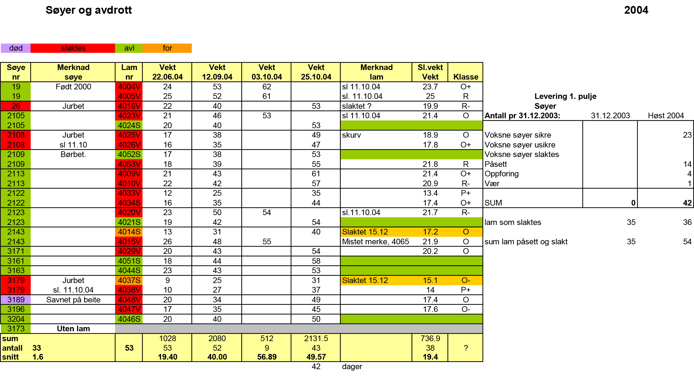

# sheep_data_analysis
Short study of a dataset from a sheep farm recorded between year 2000 to 2013, using ANOVA and PCA implemented in r-code.

# Introduction

This report presents a study of a dataset from a sheep farm recorded between year 2000 to 2013. 
This particular farm, *Leirmo*, was in fact run by the authors parents. The weight of $n_{lambs} = 796$ lambs have been registered at multiple times per season, but the data set also includes some additional information. 
The aim of this report is to do inference on which factors affects the production of the sheep farm. 
By production we mean the quality and quantity of meat at the time of slaughtering.

# Dataset

The original dataset was stored as an .xls file with sheets looking like the one below, containing some of the data from 2004.

